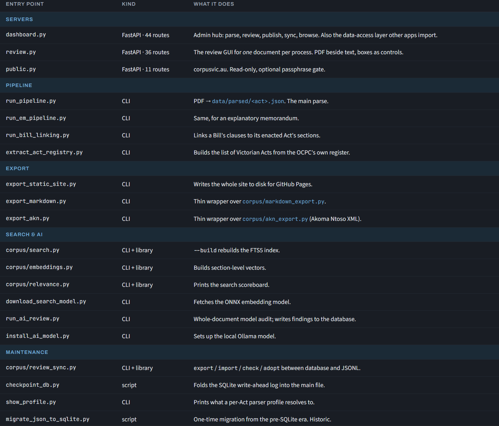

# Corpus Overview

1. **Extracting:** extract.py - PyMuPDF reads the PDF into positioned, styled text lines. Geometry and typography are preserved; this is what the parser reasons about.
2. **Parsing:** parse.py - Steered by profiles.py (per-Act patterns) and is assisted by tables.py, endnotes.py, history_notes.py, toc.py, em_parser.py. Turns the extracted information into 'nodes.'
3. **Mapping:** tree.py - Creates the pathing for each node (which Part, Division, Section, etc.) sits where. Uses hierarchy.py to achieve this, and it's labelling (e.g. Section 1(2)(a)).
4. **Reviewing** review.py - A human checks the provisions against the PDF and writes it out to db.py.
5. **Syncing:** review_sync.py - Writes the database out as a per-Act JSONL with sync.py driving git.
6. **Rendering:** reader.py - Assembles the pages. html_view.py renders the pages. The various pages are served by public.py.
7. **Searching:** search.py - builds an FTS5 index, query.py interprets what a reader types and embedding.py allows semantic ranking.

